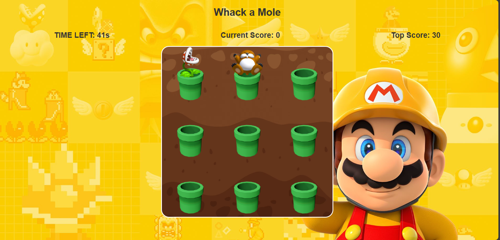

"# -Whack--Game" 
# Whack-a-Mole Game

This is a simple Whack-a-Mole game implemented using HTML, CSS, and JavaScript.

## Description

Whack-a-Mole is a classic arcade game where the player has to hit appearing moles with a hammer before they disappear. The goal is to score as many points as possible within the time limit by hitting the moles while avoiding hitting other objects.

Run Online: [Whack-a-Mole Game](https://yash-pandey07.github.io/-Whack--Game/)

## Features

- Click to whack moles as they appear on the game board.
- Score points for each successful whack.
- Time limit for the game.
- Restart button to start a new game.
- Top score tracking.
- Increasing difficulty as the game progresses.

## Screenshots



## Usage

1. Clone the repository:

```bash
git clone https://github.com/Yash-Pandey07/-Whack--Game

